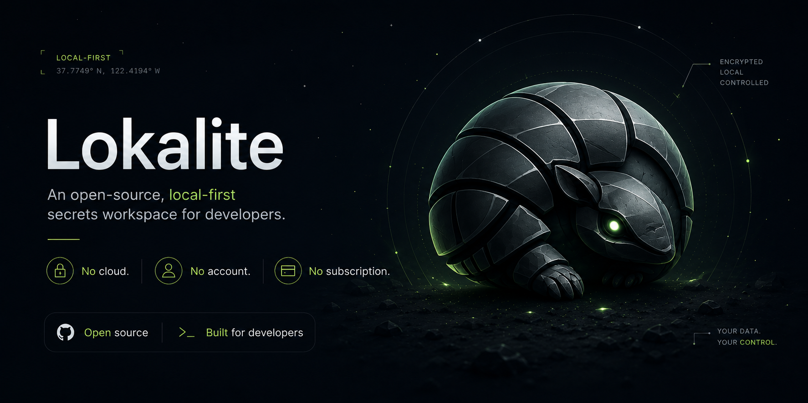

<p align="center">
  
</p>

Lokalite is a local-first secrets manager for macOS, built for how developers work with AI coding agents. Your API keys, tokens, and credentials live in an encrypted vault on your machine. When an agent needs one, the value is delivered into its shell runtime, never into the chat — so secrets stay out of the model's context and your conversation history. Reaches Claude Code, Cursor, and Windsurf through MCP, on your terms, with every access logged. Menu bar app, CLI, and MCP server in one. No cloud, no accounts, no telemetry.

## Why Lokalite

- **vs. `.env` files**: values are encrypted at rest instead of sitting in plaintext, access is logged, and the same secrets are available to your shell, the CLI, and your AI agents without copy-pasting between files.
- **vs. cloud secret managers** (Doppler, Infisical, 1Password): nothing leaves your machine. No account to create, no per-seat billing, no vendor to trust with your credentials. Local-first is the point, not a limitation.
- **Built for agents**: an AI agent loads the secrets it needs through MCP — the value reaches its shell runtime via a one-time handoff, never the chat transcript or the model's context. Logged, read-only by default, scoped per project; no pasting keys into a conversation.

## Features

- **Encrypted vault**: AES-256-GCM via CryptoKit, vault key stored in Apple Keychain
- **Touch ID unlock**: biometric authentication before accessing any secret
- **Menu bar app**: search, copy, and reveal secrets without leaving your workflow; recent secrets surfaced at the top
- **Global keyboard shortcut**: open the popover from anywhere, configurable in Settings (default `⌘⇧Space`)
- **Full CLI**: read, write, and inject secrets from the terminal
- **Projects**: group secrets by project; link to a local directory for automatic resolution
- **Environments**: per-project environment profiles (dev, staging, production) with per-environment secret values; every project starts with a Default environment
- **`.env` import/export**: pull from an existing `.env` file or export back to one
- **Encrypted backup/restore**: `lokalite backup` writes a passphrase-encrypted file; `lokalite restore` reads it back
- **Shell injection**: `eval $(lokalite shell)` exports secrets into the current session
- **Clipboard auto-clear**: copied values are wiped after 30 seconds
- **Session timeout**: vault auto-locks after inactivity
- **MCP integration**: expose your vault as tools to Claude Code, Cursor, Windsurf, and any other MCP-compatible agent
- **Secret references**: commit `lokalite://project/KEY` instead of a token in MCP configs; `lokalite run --refs-only` resolves it at spawn time
- **Zero runtime dependencies**: no cloud, no telemetry, no vendor lock-in

## Requirements

- macOS 14 or later

## Install

### Everything (recommended)

CLI, MCP server, and menu bar app via Homebrew:

```bash
brew install RubenGlez/lokalite/lokalite
brew install --cask RubenGlez/lokalite/lokalite-app
lokalite install   # registers the MCP server in ~/.claude.json
```

### CLI and MCP only

If you don't need the menu bar app:

```bash
brew install RubenGlez/lokalite/lokalite
lokalite install
```

### Menu bar app only

If you already have the CLI installed or don't need it:

```bash
brew install --cask RubenGlez/lokalite/lokalite-app
```

### Without Homebrew

Download from the [Releases page](https://github.com/RubenGlez/lokalite/releases):

- **CLI**: run the `.pkg` installer, then `lokalite install`
- **Menu bar app**: drag the `.dmg` to Applications and launch it — no quarantine workaround needed.

  Releases are signed with an Apple Developer ID and notarized by Apple, so Gatekeeper accepts the app on first launch. Every release also ships a `SHA256SUMS` file you can verify against the artifacts.

## CLI

```bash
# Initialise a project from the current directory
lokalite init

# Check vault state (active project, env, secret count, MCP status)
lokalite status
lokalite status --json

# View the secret access log (which agent read/changed what, and from where)
lokalite log
lokalite log --limit 20
lokalite log --source cli       # filter by app, cli, or mcp
lokalite log --agent claude     # filter by the AI agent that accessed the secret

# Add a secret
lokalite add OPENAI_API_KEY sk-...
lokalite add OPENAI_API_KEY          # no value: prompts for it, keeping it out of shell history
echo -n "sk-..." | lokalite add OPENAI_API_KEY -   # or pipe it via stdin

# Get a secret (prints to stdout, pipeable)
lokalite get OPENAI_API_KEY

# Copy to clipboard (auto-clears after 30s)
lokalite copy OPENAI_API_KEY

# List all secrets
lokalite list

# Filter secrets by name or description (case-insensitive substring)
lokalite list --search openai

# Update a secret (also supports the prompt/stdin forms shown for `add`)
lokalite set OPENAI_API_KEY sk-new-...

# Delete a secret
lokalite delete OPENAI_API_KEY

# Run a command with secrets injected as environment variables
lokalite run -- npm start
lokalite run --keys OPENAI_API_KEY,ANTHROPIC_API_KEY -- claude
lokalite run --refs-only -- npx some-server   # resolve lokalite:// references only (see Secret references)

# Manage projects
lokalite project add MyProject
lokalite project list
lokalite project use MyProject
lokalite project link [<name>] [--path <dir>]   # link to a directory; defaults to cwd
lokalite project link --unlink <name>            # remove path association
lokalite project delete MyProject

# Manage environments
lokalite env add staging
lokalite env list
lokalite env use staging
lokalite env delete staging

# Import from a .env file
lokalite import .env
lokalite import .env --overwrite        # overwrite existing secrets

# Export
lokalite export --output backup.lk          # encrypted (default), includes everything
lokalite export --plain --output secrets.json   # plaintext: approve-tier secrets are skipped (named on stderr)
lokalite export --format env                # .env format, stdout; approve-tier secrets are skipped
lokalite export --format env --output .env

# Encrypted backup / restore (a project's active environment)
lokalite backup                             # prompts for a passphrase, writes a timestamped .lokalite file (approve-tier secrets are skipped)
lokalite backup --output backup.lokalite
lokalite restore backup.lokalite            # prompts for the passphrase, skips existing secrets
lokalite restore backup.lokalite --overwrite

# Inject secrets into the current shell session (see security note below)
eval $(lokalite shell)
eval $(lokalite shell --keys OPENAI_API_KEY,ANTHROPIC_API_KEY)
```

> **Shell injection note:** `eval $(lokalite shell)` makes secrets visible to all child processes and shows up in `env` output for the duration of your session. Use `lokalite run` to scope secrets to a single subprocess instead.

## Menu Bar App

Click the armadillo icon in your menu bar (or press the global shortcut, default `⌘⇧Space`) to open the vault popover. The popover shows recently copied secrets at the top, then all secrets for the active project and environment. Use the project and environment menus in the header to switch context, and click **Open Lokalite** in the footer to open the full secrets manager window.

The secrets manager is a three-column layout:
- **Left sidebar**: project list; create, rename, and delete projects; set icon and link to a local directory
- **Centre column**: environment switcher and searchable secrets list for the selected project
- **Right panel**: edit the selected secret's value; save or delete

On first launch, an onboarding screen guides you through creating your first project.

## MCP Integration

By default `lokalite mcp` **brokers vault access through the running Lokalite app** over a local Unix socket, so the MCP server process never holds the vault key — it asks the app, which is the only process that can decrypt. The app is launched automatically if it isn't running. Pass `--local` to open the vault in-process instead (for CI/headless use, where the value then passes through the MCP process).

`lokalite install` registers the MCP server with Claude Code automatically (writing `~/.claude.json`). To register with a different client, pass `--client`:

```bash
lokalite install --client claude          # ~/.claude.json (default)
lokalite install --client claude-desktop  # ~/Library/Application Support/Claude/claude_desktop_config.json
lokalite install --client cursor          # ~/.cursor/mcp.json
lokalite install --client windsurf        # ~/.codeium/windsurf/mcp_config.json
```

For any other MCP-compatible agent, add the same server block to its config manually:

```json
{
  "mcpServers": {
    "lokalite": {
      "command": "lokalite",
      "args": ["mcp"]
    }
  }
}
```

By default the server is **read-only** and exposes these tools:

| Tool | Description |
|---|---|
| `list_secrets` | List secret names, categories, and descriptions (values never exposed) |
| `list_projects` | List projects and their linked directories (no values); use when no project resolves |
| `list_environments` | List a project's environments, marking the active one (no values) |
| `use_environment` | Switch the project's active environment — the one secrets resolve from by default |
| `get_secret` | Load a secret into the agent's shell environment via a one-time handoff — the value is never returned to the model |

`use_environment` switches the project's **single active environment**, the same one the menu bar app, the manager, and `lokalite env use` use — switching from the agent updates all of them, and the app refreshes live. For a one-off read from a different environment without switching, pass an `environment` argument to `get_secret` instead.

`get_secret` does **not** return the secret value. It writes the value to a single-use, owner-only shell script and returns a `source '<path>'` command; the agent runs that in its own shell to load the variable, then runs its program in the same shell. The raw value never enters the conversation/model context, the script self-deletes on first source, and any unsourced script is swept after 120s. The server also sends `instructions` on connect describing this flow and telling agents never to print a loaded variable or copy a secret into `.env`/config/source.

When a tool call omits `project`, the server auto-resolves it from the caller's working directory using the project's linked path — the same way the CLI does. Pass an absolute `path` argument with the directory to resolve (preferred, since the server's own process may run elsewhere); otherwise it falls back to the server process's working directory. An explicit `project` argument (or `LOKALITE_PROJECT` in the server `env`) always wins.

Pass `--read-write` to also expose write tools:

```json
{ "command": "lokalite", "args": ["mcp", "--read-write"] }
```

| Tool | Description |
|---|---|
| `add_secret` | Create a new secret |
| `set_secret` | Update an existing secret's value |
| `delete_secret` | Permanently delete a secret |

> **Security note:** the handoff keeps secret values out of the model's context, but an agent that can name a secret can still load it into a shell it controls (`list_secrets` gives it the names), and a sourced value is then visible to processes in that shell. Set a per-secret agent-access tier with `lokalite agent-access <name> allow|approve|block` (or from the app's secret editor):
>
> - **block** — off-limits: `get_secret` refuses it, `list_secrets` flags it `[off-limits to agents]`.
> - **approve** — consent-on-read: every read through the app broker — an agent's `get_secret`, a `lokalite://` reference, or the CLI's `get`/`copy` — prompts for Touch ID before the value is released, whoever is asking; the approval then lasts for the rest of the unlock session. `list_secrets` flags it `[approval required]`. With `--local` (no app to prompt) it fails closed, like block.
> - **allow** — the default.
>
> The CLI `get`/`copy` route an `approve` secret through the Lokalite app for the Touch ID prompt (and refuse, with no override, when the app isn't reachable); bulk reveals (`shell`, plaintext `export`, bulk `run` injection, `backup`) skip `approve` secrets and name them on stderr. A `block` secret is refused when an AI agent is detected in the calling process tree. Also keep the server read-only (the default), scope it to a single project by setting `LOKALITE_PROJECT` in the server's `env` config, and prefer clients that ask for approval before tool calls. Every MCP access is recorded in the activity log.

## Secret references

A `lokalite://` reference stands in for a secret's value anywhere an environment variable is configured. References carry no secret material, so they are safe to commit. Three forms:

- `lokalite://KEY` — project resolved like the CLI does (linked directory, then active project); the project's active environment
- `lokalite://myproject/KEY` — explicit project, its active environment
- `lokalite://myproject/staging/KEY` — fully qualified

`lokalite run` scans its inherited environment for `lokalite://` values and swaps each for the real secret value in the child process's environment before spawning. Pass `--refs-only` to skip the bulk injection of project secrets and resolve only the references. Any other environment variable is inherited unchanged.

The primary use case is MCP server configs (`~/.claude.json`, a project's `.mcp.json`, `claude_desktop_config.json`), which otherwise carry tokens in plaintext `env` blocks:

```json
{
  "mcpServers": {
    "github": {
      "command": "lokalite",
      "args": ["run", "--refs-only", "--", "npx", "-y", "@modelcontextprotocol/server-github"],
      "env": { "GITHUB_TOKEN": "lokalite://myproject/GITHUB_TOKEN" }
    }
  }
}
```

The MCP host puts the reference in the child environment; `lokalite run` replaces it with the real value before the server starts. The value never appears in the config file, the host's context, or the repo.

References are resolved **through the Lokalite app** (the same broker the MCP server uses), so the per-secret agent-access tiers apply at spawn time — a `block`-tier reference is refused, an `approve`-tier reference prompts for Touch ID whoever spawned the command — and every read lands in the activity log with agent attribution. Pass `--local` to resolve in-process for CI/headless use; approval-tier and blocked secrets are then unavailable when an AI agent is detected.

Resolution fails closed: if any reference is malformed, unknown, or denied, `lokalite run` prints the environment variable and the reference (never a value), exits non-zero, and the command is not run.

## Security

- **Values**: every secret value is encrypted with AES-256-GCM before being written to disk. The 256-bit vault key is generated on first use and stored in your macOS login keychain — it is never written to the vault file.
- **Metadata**: secret names, descriptions, project names, linked paths, and the access activity log are stored unencrypted in `~/Library/Application Support/Lokalite/vault.db`. They reveal which services you use, not the credentials themselves; the file relies on home-directory permissions and FileVault.
- **App unlock**: the menu bar app requires Touch ID or your device password before showing secrets, and auto-locks after the session timeout.
- **CLI and MCP**: commands read the vault key from the login keychain without an extra prompt. The trust boundary is your unlocked macOS user session — anything running as your user with keychain access can read secrets, just like with `~/.aws/credentials` or `.env` files (which Lokalite improves on by encrypting values at rest and logging access).
- **Clipboard**: copies are marked with `org.nspasteboard.ConcealedType` so well-behaved clipboard managers skip them, and are auto-cleared after 30 seconds.
- Nothing leaves your machine: no cloud, no telemetry.

## License

MIT
